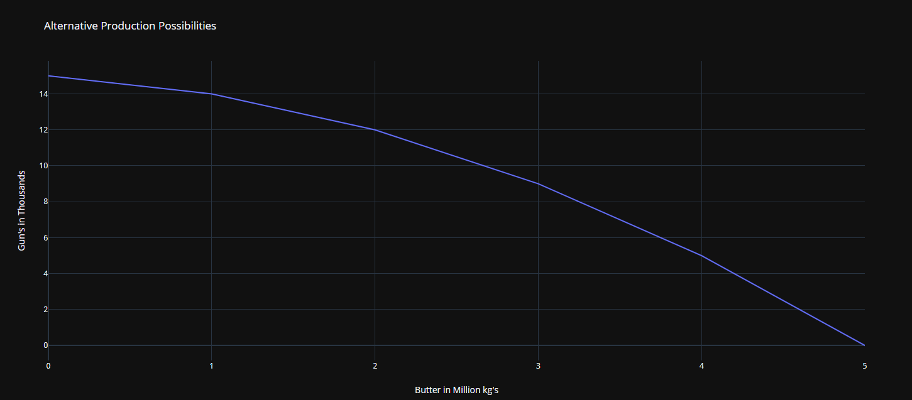
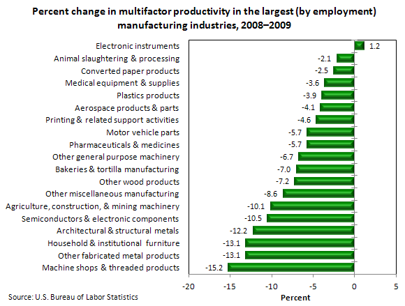
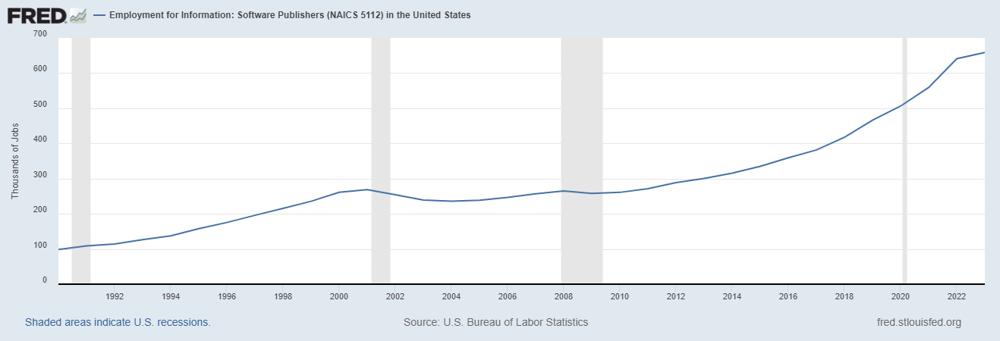
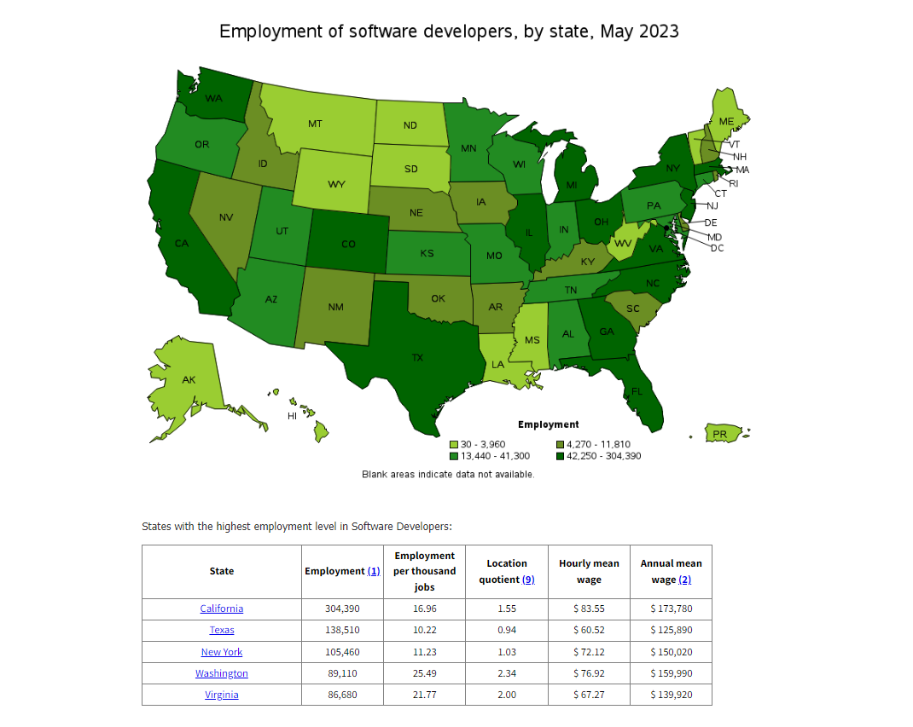
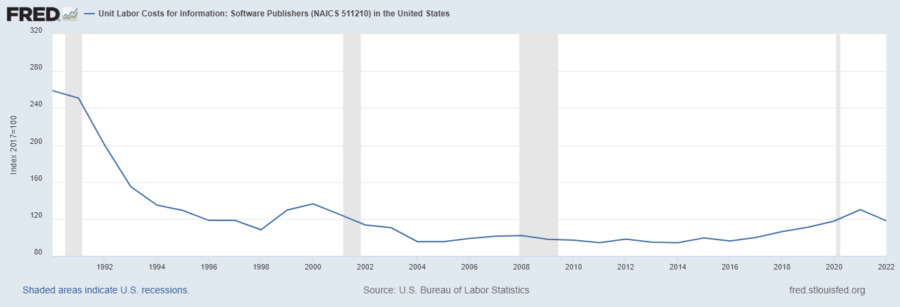
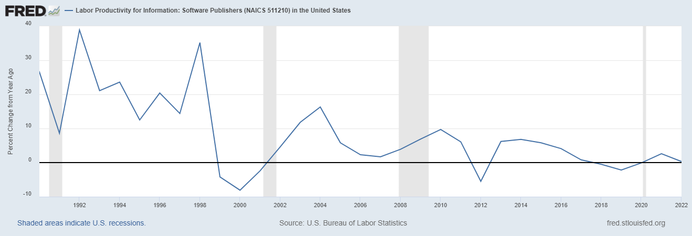
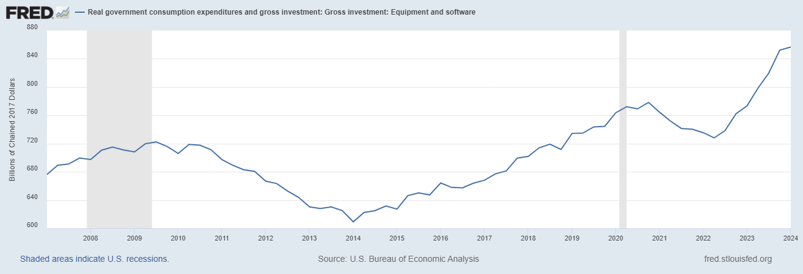

### Overview

This blog covers a detailed analysis of USA's tech dominance and the challenges faced in seimiconductor manufacturing. I have used a simple PPF model to explain the trade-offs between silicon and code.

### What is Semiconductor?

Semiconductors are materials that have electrical conductivity between conductors (like copper) and insulators (like glass). They are the foundation of modern electronics and are used in a wide range of applications, from computers and smartphones to cars and medical devices basically everything that needs electricty to run. In simple words a mixture of elements that uses specific laws of physics to control the flow of electricity to manipulate signals better known as hardware.

### The PRODUCTION POSSIBILITIES FRONTIER (PPF)

In the book "Economics" by Paul Samuelson and William Nordhaus, the Production Possibilities Fr"ontier (PPF) is explain beautifully. In a simple scenerio a country cannot have unlimited amounts of all goods. They are limited by the resources and technology available to them. An example from the book: The choice by considering an economy which only produces two goods - guns and butter. The guns ofcourse represent military spending and the butter stands for
civilian spending. Suppose that our economy decides to throw all its energy into producing civilian good, butter. There is a maximum amount of butter that can be produced per year. The maximal amount of butter dependes on the quantity
and the quality of the economies resources and the productive efficiency with which they are used. ***To sum it all up in one sentence PPF is a metric which tells us the more we invest in one good the less resources we have for the other.*** Let's see some numbers to better understand the concept.
>Suppose we have 5 million kilograms of butter is the maximum amount that can be produced using existing technology and resources on the other extreme imagine all the resources are diverted to production of guns. Again, because the resources are limited the economy can produce only limited quantity of guns. For example if an economy produes 15,0000 guns of a certain kind if no butter is produced. Simply If we are willing to give up some butter we can have some guns and vice versa.

|  Production Possibilities |
| --- |

| Possibilities | Butter (In Million Kg) | Guns (In Thousands) |
| --- | --- | --- |
| A | 0 | 15 |
| B | 1 | 14 |
| C | 2 | 12 |
| D | 3 | 09 |
| E | 4 | 05 |
| F | 5 |  0 |

We see in the above table the more we invest in one thing the less we have to invest in the other.

### Graph of the above table

### Why use PPF to understand the trade-offs between silicon and code?

The PPF model is a simple framework or metric for understanding the trade-offs between different goods. In the case of silicon and code, the PPF model can help us understand the trade-offs between investing in semiconductor manufacturing (silicon) and investing in software development (code). The PPF model can help us understand the limits of these investments and the potential benefits of investing in one over the other.

**Past Reports' Analysis: Shifting Priorities**
For this research, I analyzed three key metrics from 1990 to 2024 to understand the differences between semiconductor manufacturing and software development in the US:

1. **Economic Spending:** How much is spent on each sector?
2. **Employment:** How many jobs are there in each sector?
3. **Ease of Doing Business:** How easy is it to start and operate businesses in each sector?

Let's start with employment data from the Bureau of Labor Statistics (BLS). The graph (link: [BLS](https://beta.bls.gov/dataViewer/view/timeseries/CES3133400001)) shows a significant decline in semiconductor manufacturing employment since   2001, reaching its lowest point in 2018.

**The Shift: Policy, Innovation, and a Globalized World**
The dominance of the United States in the tech sector isn't solely based on manufacturing muscle. Interestingly, we've seen a decline in domestic semiconductor production, with more focus shifting towards software development. This transition wasn't sudden, and several factors come into play.

**Policy and Costs: A Perfect Storm**
Government policies, regulations, and approval processes all contribute to the cost of setting up a fabrication plant (fab) in the US. Historically, America has leaned towards importing goods rather than domestic production. While this fueled innovation and patent creation (something the US still excels at), it also led to a dependence on other countries to fill the manufacturing gap.

**Innovation Powerhouses, Manufacturing Elsewhere**
Take industry giants like NVIDIA, Intel, and AMD. These companies are powerhouses of innovation, designing cutting-edge semiconductors. However, they outsource manufacturing to global leaders like TSMC in Taiwan. Even Intel has a significant R&D center in Israel, likely due to favorable government policies there.

**The Data Tells the Story**
Let's look at the data from 2008-2009, semiconductor manufacturing experienced a sharp decline of -10.5% during the same period. This drop reflects a long-term trend, with few exceptions like Texas Instruments (TI) and Integrated Device Technology (IDT) who continue domestic chip production, although their numbers are relatively low.

source: [BLS](https://www.bls.gov/opub/ted/2011/ted_20110928.htm1)

### How Software beat semiconductors?

The rise of software development in the US wasn't a random occurrence. It stemmed from several key advantages that software held over traditional semiconductor manufacturing:

**Lower Barriers to Entry:** Setting up a software development company pales in cost compared to the hefty $10-15 billion price tag of a good fabrication plant (fab) for semiconductors. Easier access to capital allows for a more dynamic and innovative software landscape.

**Regulatory Flexibility:**  Software companies face fewer regulations and approval processes compared to the semiconductor industry. This streamlined environment fosters quicker development and adaptation to market needs.

**A Thriving Workforce:** The software sector benefits from a more flexible and readily available workforce. The skills needed can be learned and honed through various educational paths, creating a wider talent pool.

**Employment Boom:** Let's look at the data! The BLS data from FRED ([FRED](https://fred.stlouisfed.org/series/IPUJN5112W200000000)) shows a dramatic rise in software industry employment, jumping from 100,000 in 1990 to a staggering 700,000 in 2022 and employment by region.

**Efficiency Gains:**  Software development has also seen significant efficiency improvements. Another FRED data set ([FRED](https://fred.stlouisfed.org/series/IPUJN511210U100000000#)) shows a decrease in unit labor cost over the years.

**Productivity Powerhouse:** Software development has become a productivity powerhouse. According to FRED data ([FRED](https://fred.stlouisfed.org/series/IPUJN511210L001000000#)), for 10 hours of work in 1990, the output was 1,000 units. In 2022, that output has jumped to 5,000 units with a fraction of the time investment (0.3 hours).

**Investment Surge:** Finally, government spending and overall investment in software, as highlighted by FRED data ([FRED](https://fred.stlouisfed.org/series/A782RX1Q020SBEA)), has steadily increased. This reinforces the growing importance of the software sector in the US economy.

By combining these factors – lower costs, greater flexibility, a thriving workforce, and impressive productivity gains – the software industry has established itself as a dominant force in the US tech sector, surpassing hardware manufacturing.

### Afterthoughts

I hope this blog has provided a clear understanding of the trade-offs between silicon and code in the US tech sector. By using the PPF model, we can see how software development has surpassed semiconductor manufacturing in recent years. This shift has been driven by lower barriers to entry, regulatory flexibility, a thriving workforce, and impressive efficiency gains. As we move forward, it will be interesting to see how these trends continue to evolve and shape the future of the US tech sector.
