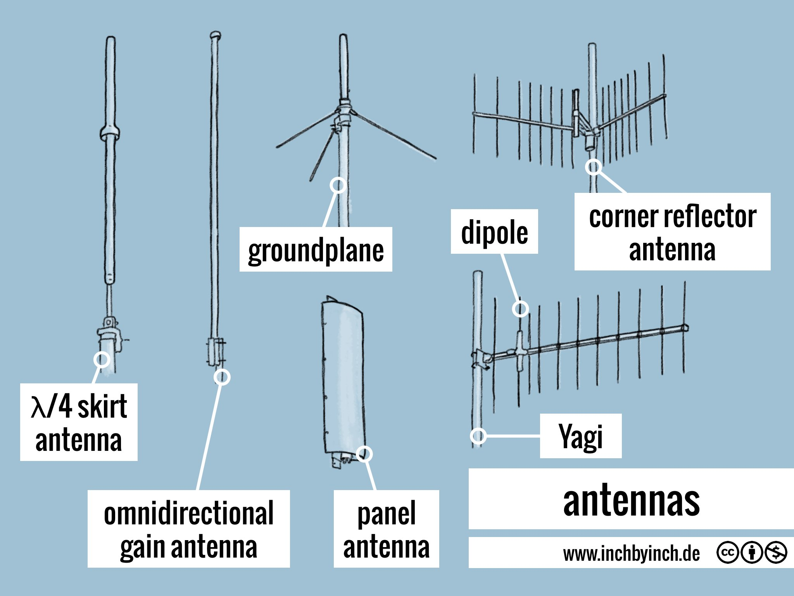
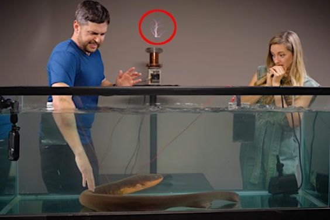
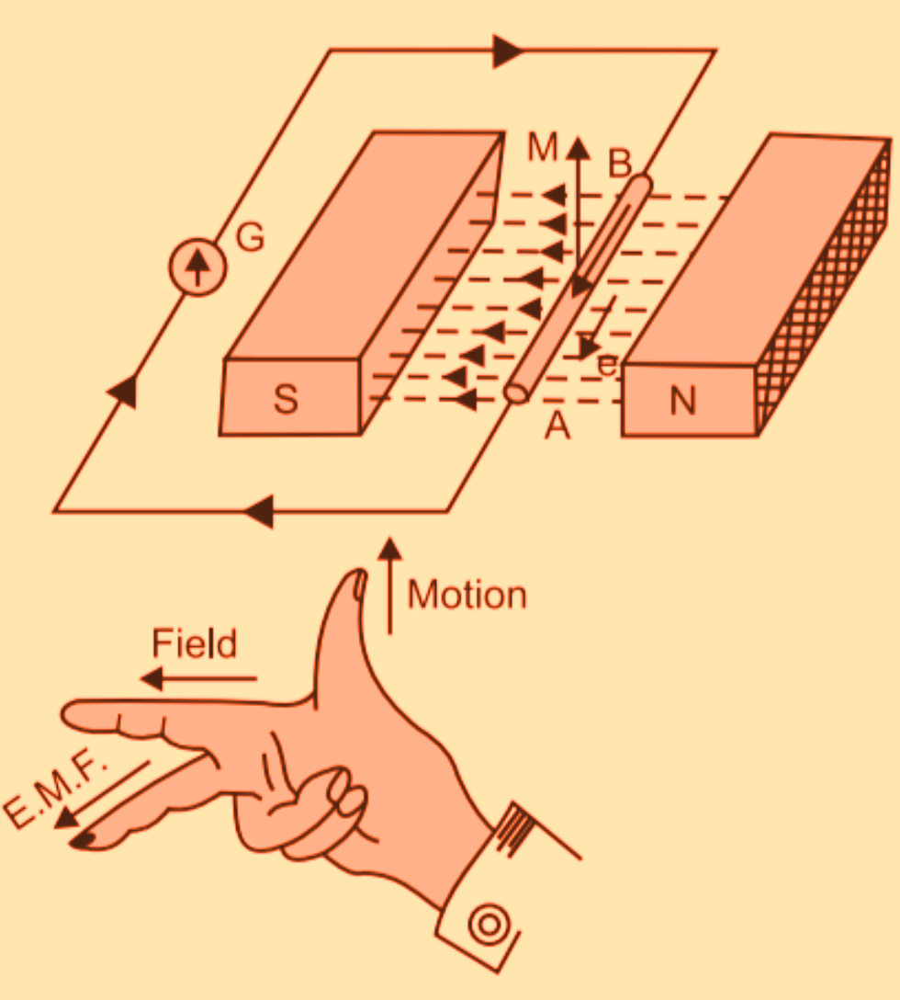
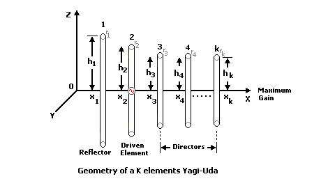
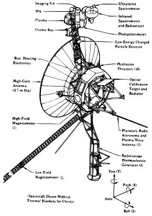
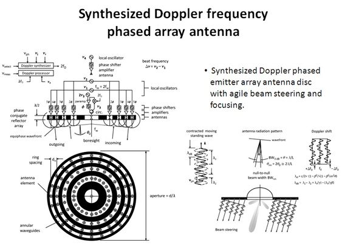
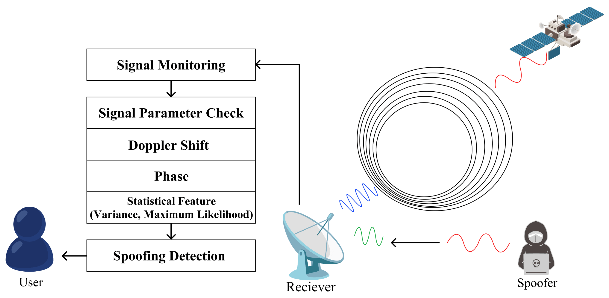
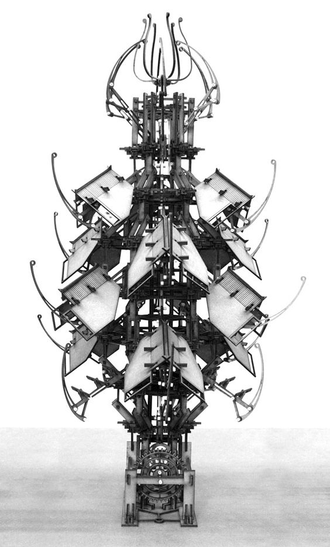

Remember when we talked about electromagnetic waves? Ehh, maybe not. It was about as memorable as your cousin's slideshow of their pet rock collection. But hold onto your hats (tinfoil or otherwise), because today we're going to learn about antennas. These aren't just metal rods for your cat to knock over – they're the unsung heroes of our wireless world. Without them, we'd all be back to using tin cans and string. Or worse, actually talking to people face-to-face. The horror!

*From "rabbit ears" to satellite dishes: The antenna family reunion. Awkward small talk not included.*

# Nature's Own Design: When Mother Nature Went Wireless (And Didn't Bother to Patent It)

Before we humans got all smug about inventing wireless communication, nature had already filed the patent. Well, not really. Mother Nature is terrible at paperwork. Take the electric eel, for instance. It's basically a swimming battery with fins, capable of generating and detecting electric fields. Then there's the shark with its ampullae of Lorenzini (try saying that five times fast after a few margaritas). These jelly-filled pores are so sensitive to electromagnetic signals, they can detect a AA battery from miles away. Makes you wonder if Jaws was just misunderstood and looking for a quick charge. "I don't want to eat you, I just need to power my remote!"

*Electric eel: Nature's way of saying "stay out of the water" and "I've got the power!" simultaneously*

Even plants use bioelectric fields for communication. Yes, your houseplants are talking behind your back. They're probably complaining about your inconsistent watering schedule. "Water? In this economy?"

# The Fundamental Principle: It's All About That Induction, No Trouble (Well, Maybe a Little Trouble)

At its core, an antenna works on the principle of electromagnetic induction, discovered by Michael Faraday in 1831. Legend has it that Faraday was so excited about his discovery, he ran around his lab shouting "Eureka!" and accidentally invented the first electric fan. (Okay, I made that last part up, but wouldn't it be cool if it were true? maybe not.)

Here's where it gets clever: an antenna is sized just right to vibe with electromagnetic waves of a specific frequency. It's like a tuning fork for invisible waves, or that one friend who always knows the latest gossip. When a wave of the right frequency hits the antenna, it sets up electric currents that oscillate faster than a caffeinated squirrel on a hot tin roof. And when we feed an oscillating current into the antenna, it spits out electromagnetic waves like a radio DJ launching hit after hit. Or like me after too much coffee and beans.

*Electromagnetic induction: Like a never-ending game of tag between electricity and magnetism. Spoiler: Neither ever wins.*

# The Mathematics of Brilliance: Warning - May Cause Headaches

Now, brace yourselves. We're about to drop some serious math. The radiation pattern of a simple dipole antenna is given by:

$$
E(\theta) = j\eta\frac{I_0e^{-jkr}}{2\pi r}\frac{\cos(\frac{\pi}{2}\cos\theta)}{\sin\theta}
$$

Don't panic! This equation isn't trying to divide by zero or summon ancient spirits. It's just a fancy way of saying "the signal goes this way, but not that way, and definitely not over there." If this makes your brain hurt, just nod sagely and mutter "Ah, yes, of course" like the rest of us.

# Beyond the Dipole: A Symphony of Designs (or "Antenna Engineers Gone Wild")

While the dipole antenna is the vanilla ice cream of the antenna world, engineers have created a whole Baskin-Robbins of designs:

1. **Yagi-Uda Antenna**: Looks like a fishbone, works like a charm. It's the mullet of antennas: business in the front, party in the back.

2. **Parabolic Antenna**: Uses the math of parabolas to focus waves. It's basically a giant metal wok for catching signals instead of stir-frying veggies.

3. **Phased Array Antenna**: This bad boy uses multiple elements and precise timing to steer a beam electronically. It's like having a hundred tiny antennas doing the wave in perfect sync.

*The antenna fashion show: From practical to "what were they thinking?"*

# Antennas: The Ultimate Readers and Writers

Remember in our last blog post when we talked about electromagnetic waves being the alphabet of wireless communication? Well, if electromagnetic waves are the alphabet, then antennas are the pens and eyes of the wireless world. They're the ultimate readers and writers of these invisible messages floating around us.

## Writing with Antennas: From Electrons to Airwaves

When an antenna "writes" a signal, it's like translating a book into a secret code. Here's how it goes down:

1. Your device (let's say your phone) creates an electrical signal. This is like your thoughts being turned into words.
2. This electrical signal is fed into the antenna. Think of this as picking up a pen.
3. The antenna converts this electrical energy into electromagnetic waves. It's like writing your message in invisible ink that can travel through air.
4. These waves radiate out from the antenna, carrying your "message" (data) with them. Imagine throwing paper airplanes with your message, but these planes can travel at the speed of light!

## Reading with Antennas: Catching Whispers from the Ether

Now, when an antenna "reads" a signal, it's doing the reverse process:

1. Electromagnetic waves hit the antenna. It's like catching those light-speed paper airplanes.
2. The antenna converts these waves back into electrical signals. Imagine the invisible ink becoming visible again.
3. These electrical signals are then processed by your device. This is like your brain interpreting the words it sees.
4. Voila! Your device now understands the message that was sent.

This read-write process happens billions of times a second in our modern world. Every time you stream a video, send a text, or check your email, you're using antennas to read and write in the language of electromagnetic waves.

It's pretty mind-blowing when you think about it. Your words, pictures, and cat videos are constantly being turned into invisible waves, flung across space, and reassembled on someone else's device. And antennas are the unsung heroes making it all possible.

So next time you're frustrated by a weak Wi-Fi signal, remember: there's an antenna in your device valiantly trying to read a message written in the air. Maybe give it a little pat of encouragement. Just don't expect it to grow any bigger – we're not in the rabbit ears era anymore!

# The Dark Side: When Antennas Go Rogue

Now, here's where things get a bit James Bond. The same principles that make antennas so great can also be used for nefarious purposes. A skilled hacker with the right equipment can intercept or mimic wireless signals. It's like eavesdropping, but for your phone's deepest, darkest secrets.

## Signal Interception: Your Data's Wild Ride

Any antenna tuned to the right frequency can pick up wireless signals. While encryption protects most content, metadata like signal strength and direction can still be valuable. It's like a game of "Hot and Cold" but for spies.

## Mimicking and Spoofing: The Antenna Identity Crisis

Hackers can use antennas to mimic legitimate signals, creating fake WiFi hotspots or spoofing GPS. Remember the 2016 Tesla key fob hack? Researchers used custom antennas to trick cars into unlocking. It's a reminder that even as antennas enable our wireless utopia, they can also be the lockpicks of the digital world.

*Hacking diagram: Or as we call it, "Why paranoia is sometimes justified"*

# Defending the Airwaves: Your Tin Foil Hat Won't Cut It

Fear not! The same antenna theory that enables these attacks also provides defenses. We've got directional antennas to limit signal spread (like a spotlight instead of a floodlight), frequency hopping to evade interception (imagine trying to follow a conversation where the language changes every second), and signal strength analysis to detect spoofing (because fake signals are like fake smiles – they just don't quite reach the eyes).

# The Future: Antennas at the Cutting Edge (Cue the Sci-Fi Music)

As we push into new frontiers, antenna design keeps evolving. We're talking:

1. **Metamaterial Antennas**: Using artificially structured materials to create antennas with properties not found in nature. It's like giving antennas superpowers.

2. **Plasma Antennas**: Using ionized gas instead of metal. Finally, a use for all that excess static electricity you generate walking on carpet!

3. **Quantum Antennas**: Leveraging quantum effects for ultra-sensitive detection. It's like giving Schrödinger's cat a job in telecommunications.

*Future antennas: Coming soon to a sci-fi movie near you*

# Conclusion: The Ongoing Brilliance of Antenna Design

From nature's bioelectric wonders to quantum antennas that would make Einstein scratch his head, the story of antenna design is one wild ride. It's where physics meets engineering, and together they throw a party that's revolutionized our world.

As we continue to push the boundaries of wireless tech, antennas will be right there, silently enabling your Netflix binge-watching and your "I'm five minutes away" texts (even when you haven't left the house yet).

Stay tuned for our next installment, where we'll dive into signal processing. We'll explore how we extract meaning from the electromagnetic soup that surrounds us, or as I like to call it, "How to hear a pin drop in a hurricane." Until then, keep your antennas up!