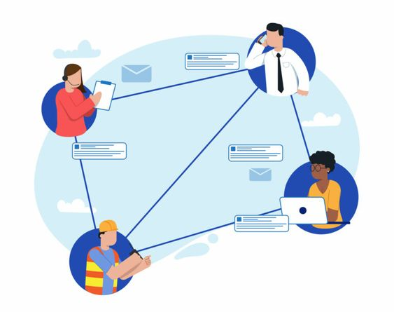
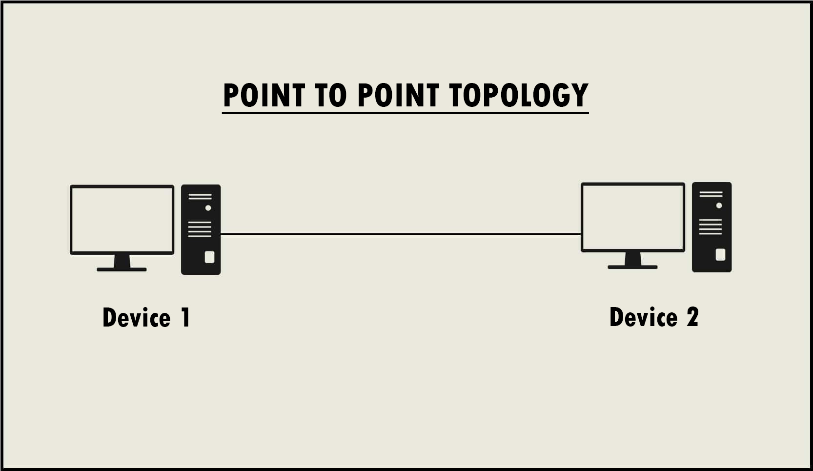
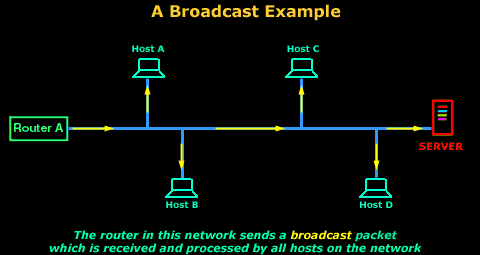
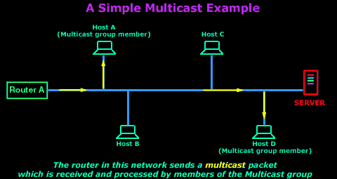
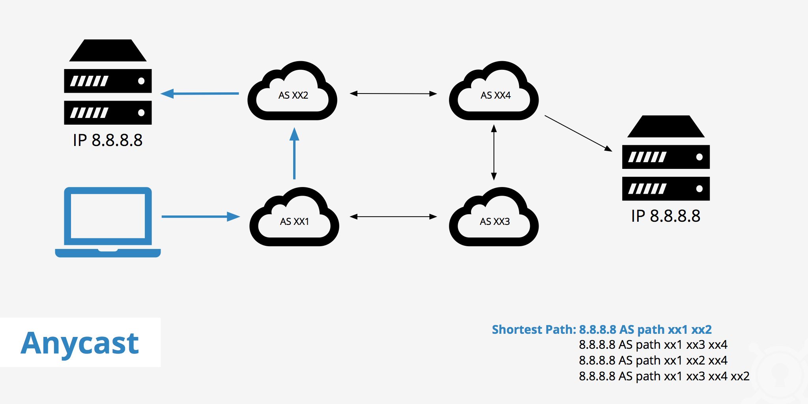
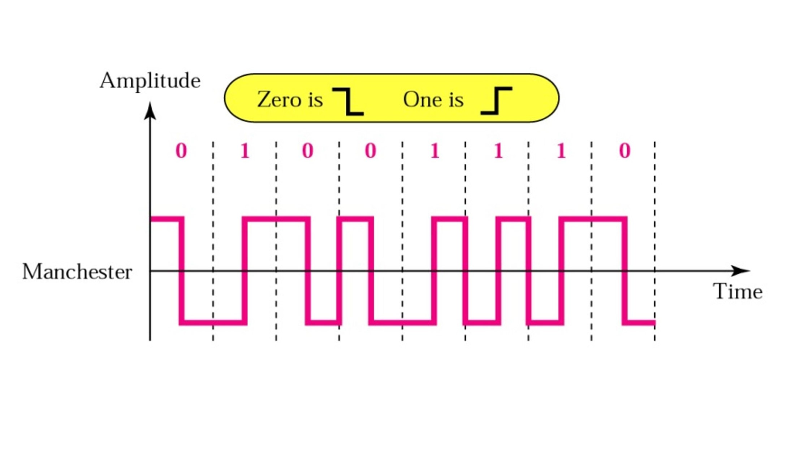

Remember when we talked about electromagnetic waves in our [Electromagnetic Engineering](https://encryptica-blog.vercel.app/blog/digital-communication)? Well, hold onto your bits and bytes, because today we're going to learn about digital communication. It's like the secret language your devices speak when they're gossiping behind your back. Except instead of words, they're using 1s and 0s. Fancy, right?



*Welcome to the party where electrons do the Cha-Cha Slide across wires and through the air!*

# The ABCs of Digital: When 1s and 0s become Letters

Before we humans invented digital communication, our own brains were already rocking the binary lifestyle. Think about it - neurons fire in an all-or-nothing fashion. It's like they were doing the digital dance long before we even knew what a computer was. Sound familiar? Yep, it's basically binary, but with more squishy bits and fewer silicon chips.

Now, let's talk math. Because what's a good tech blog without some equations to make your brain do somersaults?


<div style="background-color: #e6f7ff; padding: 10px; border-radius: 5px; color: black; margin: 20px 0;">

Math Alert! (Don't worry, we'll hold your hand)

In the digital world, we represent information using discrete values, typically 0s and 1s. For example, the binary number `1011` can be expressed in decimal as:

$$
1 \times 2^3 + 0 \times 2^2 + 1 \times 2^1 + 1 \times 2^0 = 8 + 0 + 2 + 1 = 11
$$

See? It's just like counting numbers!

</div>

# A Brief History of Ones and Zeros: When Morse Code Got Jealous

Digital communication didn't just pop up overnight like a suspicious mole. It has a rich history:

- **1940s**: Claude Shannon shows up and drops the mic with information theory. Suddenly, math nerds everywhere are talking about "bits" and it's not a reference to binary digits... oh wait, it is!
- **1960s**: Pulse Code Modulation (PCM) enters the chat. Voice goes digital, and phone calls never sound the same again.
- **1980s**: Digital Signal Processing (DSP) crashes the party. Suddenly, we can manipulate signals like never before. It's like Photoshop, but for sound and data!
- **1990s**: The internet explodes onto the scene. Email becomes a thing, and "You've Got Mail" becomes more than just a rom-com title.
- **2000s and Beyond**: Smartphones, 4G, 5G, and beyond. We're basically living in a sci-fi novel now.

# The Digital Communication Family: It's Complicated

Digital communication isn't a one-size-fits-all deal. It's more like a complex, dynamic family reunion, each member with its unique characteristics and roles:

1. **Point-to-Point Communication**: The introvert of the family. Prefers intimate, direct connections where messages travel between a single transmitter and receiver. This method is akin to a private conversation in a quiet room, ensuring that the communication is both secure and direct.

   

   Point-to-point is fundamental in scenarios where privacy and directness are paramount, such as in financial transactions or personal communications.

2. **Broadcast Communication**: The loud uncle who doesn't just tell a story but announces it to the entire room. In broadcast communication, messages are sent from one point to all other points within the network. It's like using a loudspeaker at a family gathering to make sure everyone gets the same message simultaneously.

   

   This form is essential for disseminating information widely and efficiently, such as in television broadcasts or emergency alert systems.

3. **Multicast Communication**: The cool cousin who organizes private events. Multicast is for exclusive communications where messages are addressed from one or more points to a specific group of recipients. It's like sending out invites to only a select few family members for a special gathering.

   

   Useful in scenarios like streaming video content to a specific audience or for online gaming where only certain users need to receive the same data.

4. **Anycast Communication**: The family member who knows all the shortcuts to the buffet. In anycast, data is sent from one point to the nearest of several potential receivers. It's like having several food stations at the reunion, and guests go to the nearest one to avoid long lines.

   

   Anycast is used in distributed computing environments to reduce latency and improve load distribution, such as in Content Delivery Networks (CDNs) where the goal is to provide the fastest service to users by connecting them to the nearest server.

# Line Coding: When Zeros and Ones Put on Their Dancing Shoes

Now, let's talk about line coding. It's how we make those 1s and 0s boogie across transmission lines without tripping over their own feet. Remember our discussion on wave propagation in the [Antenna and Wave Propagation blog](https://encryptica-blog.vercel.app/blog/antenna-wave-propagation)? Line coding is like choreographing a dance for those waves.

<div style="background-color: #ffebcc; padding: 10px; border-radius: 5px; color: black;">

Exploring Line Coding Techniques (Warning: May Cause Uncontrollable Urge to Draw Squiggly Lines)

Line coding techniques are essential for defining how bits are represented in the physical layer of communication systems. Here's a deeper dive into some popular methods:

- <span style="color: black; font-weight: bold;">Unipolar Encoding</span>: Often referred to as the lazy coder's choice, this method uses a single voltage level to represent a '1' and zero voltage to represent a '0'. It's straightforward and easy to implement but lacks efficiency in power usage and signal integrity over longer distances.

- <span style="color: black; font-weight: bold;">Polar Encoding</span>: Known as the drama queen of line coding, polar encoding uses a positive voltage to represent a '1' and a negative voltage for a '0'. This method is more efficient than unipolar as it better utilizes the power spectrum and reduces the likelihood of signal degradation.

- <span style="color: black; font-weight: bold;">Bipolar Encoding</span>: The hipster of encoding techniques, bipolar encoding alternates between positive and negative voltages for '1s' while '0s' are represented by zero voltage. This approach effectively reduces the DC component of the signal, minimizing the required bandwidth and improving signal integrity.

- <span style="color: black; font-weight: bold;">Manchester Encoding</span>: The overachiever in the group, Manchester encoding merges the clock and data signals into one. Each bit is represented by either a high-to-low or a low-to-high transition at the midpoint of the bit period, making it highly reliable for timing synchronization but more complex to implement.

- <span style="color: black; font-weight: bold;">Differential Manchester Encoding</span>: As the cooler sibling of Manchester encoding, this technique is also based on transitions. However, it differs in that the direction of the transition at the start of each bit period indicates the bit value, enhancing its robustness against signal degradation and making it ideal for noisy environments.

These techniques each have their unique characteristics and are chosen based on the specific requirements of the communication system, such as power efficiency, error resilience, and complexity.
</div>

Let's dive deeper into Manchester Encoding, because who doesn't love a good brain teaser?

<div style="background-color: #e6ffe6; padding: 10px; border-radius: 5px; color: black;">

<span style="color: black; font-weight: bold;">Manchester Encoding: The Math Behind the Magic</span>

In Manchester encoding, each bit is represented by a transition:
- 0 is represented by a low-to-high transition
- 1 is represented by a high-to-low transition

Mathematically, we can represent this as:

$$
S(t) = 
\begin{cases} 
-A, & 0 \leq t < T/2 \\
A, & T/2 \leq t < T 
\end{cases}
\text{ for bit '0'}
$$

$$
S(t) = 
\begin{cases} 
A, & 0 \leq t < T/2 \\
-A, & T/2 \leq t < T 
\end{cases}
\text{ for bit '1'}
$$

Where A is the amplitude and T is the bit period. Fascinating, right? Or are your eyes glazing over? Don't worry, it's normal!

The power spectral density of Manchester encoding can be expressed as:

$$
S(f) = \frac{A^2T}{4} \cdot \text{sinc}^2\left(\frac{fT}{2}\right) \cdot \sin^2(\pi fT)
$$

Where $\text{sinc}(x) = \frac{\sin(\pi x)}{\pi x}$

I hope this illustration helps you understand the concept of Manchester Encoding.



</div>

# Modulation: Making Waves (Literally)

Modulation is like giving our digital signal a fancy outfit to wear to the transmission party. We've got:

<div style="background-color: #e6f7ff; padding: 10px; border-radius: 5px; color: black;">

- <span style="color: black; font-weight: bold;">Amplitude Modulation (AM)</span>: Changes the height of the waves. It's like yelling to be heard over a crowd.

  Mathematical representation:
  $$
  s(t) = A_c[1 + m(t)]\cos(2\pi f_c t)
  $$
  Where $A_c$ is the carrier amplitude, $m(t)$ is the message signal, and $f_c$ is the carrier frequency.

- <span style="color: black; font-weight: bold;">Frequency Modulation (FM)</span>: Changes how often the waves come. It's like speaking in different accents.

  Mathematical representation:
  $$
  s(t) = A_c\cos(2\pi f_c t + 2\pi k_f \int_{0}^{t} m(\tau) d\tau)
  $$
  Where $k_f$ is the frequency sensitivity.

- <span style="color: black; font-weight: bold;">Phase Modulation (PM)</span>: Shifts the timing of the waves. It's like doing the moonwalk while delivering your message.

  Mathematical representation:
  $$
  s(t) = A_c\cos(2\pi f_c t + k_p m(t))
  $$
  Where $k_p$ is the phase sensitivity.

</div>

# Encoding and Decoding: The Secret Agents of Digital Communication

Encoding and decoding in digital communication are akin to the roles of James Bond and Q in espionage. They are crucial for preparing our messages for their digital transmission journey, ensuring they are securely encoded into a format suitable for travel, and then accurately decoded back to their original form upon arrival.

<div style="background-color: #ffe6e6; padding: 10px; border-radius: 5px; color: black;">

<span style="color: black; font-weight: bold;">ASCII Encoding: When Letters Pretend to Be Numbers</span>

To understand the magic of ASCII encoding, let's take a deeper dive into the process using the word "HI" as an example:

1. The letter 'H' in ASCII is represented by the decimal number 72. In binary, 72 is represented as 1001000.
2. The letter 'I' corresponds to the decimal number 73, which translates to 1001001 in binary.

Thus, encoding "HI" in ASCII results in the binary sequence: 1001000 1001001.

This transformation is governed by the ASCII standard, which assigns a unique 7-bit binary number to each character. The mathematical representation for converting a character 'C' with ASCII decimal value 'D' into binary is given by:

$$
B(C) = \sum_{i=0}^{6} b_i \cdot 2^i
$$

where \( b_i \) are the bits of the binary representation of 'D'.

Isn't it fascinating how two simple letters are transformed into a 14-bit binary string? This process exemplifies how digital communication leverages mathematical principles to convert and transmit data efficiently.

</div>

# The Data Journey: From Your Brain to Someone Else's Screen

Let's embark on a detailed exploration of an email's journey from your fingertips to your friend's inbox, complete with mathematical insights and colorful explanations:

<div style="background-color: #2c3e50; padding: 20px; margin-bottom: 20px; border-radius: 8px; color: #ecf0f1;">

1. **You type "LOL"**: The journey begins in your brain, which finds something amusing and decides to share the laughter. Your fingers swiftly comply, typing "LOL" into your email interface.

</div>

<div style="background-color: #343a40; padding: 20px; margin-bottom: 20px; border-radius: 8px; color: #f8f9fa;">

2. **Encoding**: Here, your email client converts "LOL" into binary code, the language of computers. This process is known as ASCII encoding, where 'L' is 76 (01001100 in binary) and 'O' is 79 (01001111 in binary). Thus, "LOL" becomes:

   ```
   01001100 01001111 01001100
   ```

   This transformation is crucial for the data to be processed and transmitted electronically.

</div>

<div style="background-color: #495057; padding: 20px; margin-bottom: 20px; border-radius: 8px; color: #f8f9fa;">

3. **Transmission**: The binary data, now representing "LOL", is prepared for transmission. This stage involves line coding techniques which convert the binary data into a signal form suitable for transmission over the communication channel. Modulation techniques such as Amplitude Modulation (AM) or Frequency Modulation (FM) may be used to encode the signal onto a carrier wave, making it ready for its journey across the internet.

   The mathematical model for AM can be represented as:
   $$
   s(t) = A_c(1 + k_a m(t))\cos(2\pi f_c t)
   $$
   where \( A_c \) is the carrier amplitude, \( k_a \) is the amplitude sensitivity, \( m(t) \) is the message signal, and \( f_c \) is the carrier frequency.

</div>

<div style="background-color: #6c757d; padding: 20px; margin-bottom: 20px; border-radius: 8px; color: #f8f9fa;">

4. **Routing**: As the signal travels through the internet, it passes through various routers. Each router determines the best path for the signal to take to reach its destination as quickly and efficiently as possible. This decision-making process is governed by routing algorithms like Dijkstra's or Bellman-Ford.

</div>

<div style="background-color: #1d3557; padding: 20px; margin-bottom: 20px; border-radius: 8px; color: #f1faee;">

5. **Reception**: Upon reaching its destination, your friend's email server receives the signal. The server's modem demodulates the signal, extracting the binary data from the carrier wave.

</div>

<div style="background-color: #264653; padding: 20px; margin-bottom: 20px; border-radius: 8px; color: #f1faee;">

6. **Decoding**: The binary data is then decoded back into text. The server interprets the binary sequence:

   ```
   01001100 01001111 01001100
   ```
   and converts it back into "LOL", reconstructing the message exactly as it was typed.

</div>

<div style="background-color: #34495e; padding: 20px; margin-bottom: 20px; border-radius: 8px; color: #ecf0f1;">

7. **Delivery**: Finally, "LOL" appears on your friend's screen. They read it and might chuckle or simply wonder what prompted the laughter. Either way, the message has completed its digital journey successfully.

</div>

This detailed breakdown shows the complex interplay of math, physics, and technology that underpins digital communication. Each time you send a text, email, or stream a video, remember the intricate processes your data undergoes to reach its destination.


*Is this the future of digital communication, or just a really fancy lava lamp? Only time will tell!*

Thank you for reading! Stay tuned for our upcoming post on Networking, coming out soon! ;)
