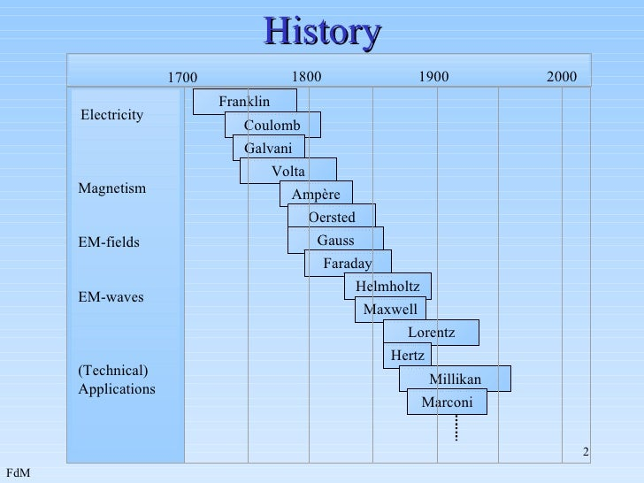
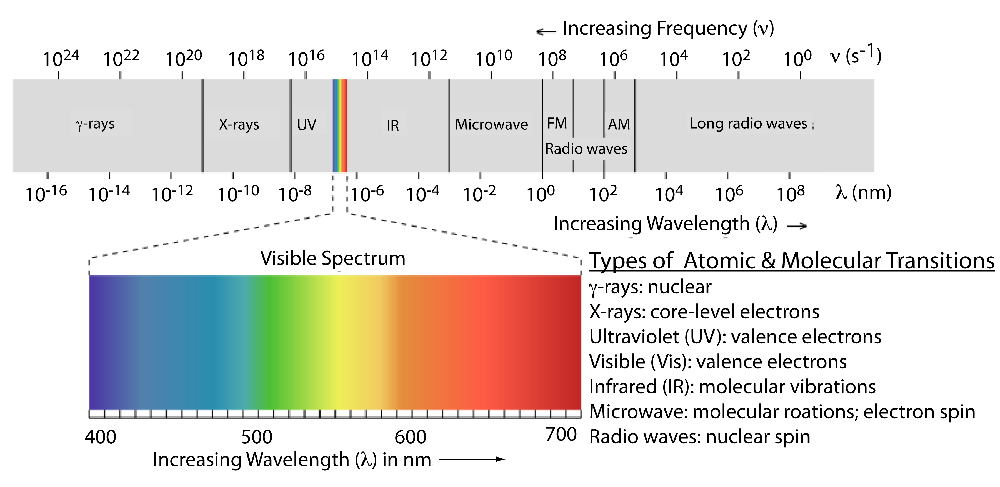

# Overview

For those who are unaware of this subject, electromagnetic engineering is simply the study of electromagnetic waves and their applications. These waves include radio, television, and the internet. By understanding the principles of electromagnetic waves, engineers can design and optimize communication systems to transmit data more efficiently and reliably. It is also plays crucial role in enabling the compactness and high throughput of modern devices such as smartphones, laptops, computers, satellites, and more.

# History

To explain briefly, it all started with the discovery of electromagnetic waves by James Clerk Maxwell in the 19th century. Maxwell's equations laid the foundation for the study of electromagnetism and paved the way for the development of modern communication systems.

Now though we give credit to Maxwell for his groundbreaking work, but there were others who made it possible for Maxwell to make these discoveries. It wouldn't be wrong to say that Electromagnetism is just 4 equations (It is not just 4 equations, I took the course.) Maxwell didn’t originally derive all of these equations. Instead, he stood on the shoulders of giants—scientists like **Carl Friedrich Gauss**, **Michael Faraday**, and **André-Marie Ampère**—who each made critical discoveries about electric and magnetic fields.

## 1. Gauss’s Law

**Carl Friedrich Gauss**, a German mathematician and physicist, gave us **Gauss's Law**, which describes the relationship between electric charges and the electric fields they produce. Mathematically, it’s expressed as:

$$
\oint_{\text{surface}} \mathbf{E} \cdot d\mathbf{A} = \frac{Q_{\text{enc}}}{\epsilon_0}
$$

where:
- $\mathbf{E}$ is the electric field,
- $d\mathbf{A}$ is the differential area on a closed surface,
- $Q_{\text{enc}}$ is the total charge enclosed within the surface,
- $\epsilon_0$ is the permittivity of free space.

This law forms the basis of how we understand electric fields generated by charges.

## 2. Faraday’s Law of Induction

Next, we have **Michael Faraday**, an English scientist whose experiments led to the formulation of **Faraday's Law of Induction**. This law tells us that a changing magnetic field can induce an electric current. Faraday’s work can be summarized by the equation:

$$
\oint_{\text{loop}} \mathbf{E} \cdot d\mathbf{l} = -\frac{d\Phi_B}{dt}
$$

where:
- $\mathbf{E}$ is the induced electric field,
- $d\mathbf{l}$ is the differential element of the loop,
- $\Phi_B$ is the magnetic flux through the loop.

This discovery was pivotal in developing technologies like transformers and electric generators, although Faraday himself didn't express it mathematically—Maxwell did that later.

## 3. Ampère’s Law

**André-Marie Ampère**, a French physicist, contributed **Ampère's Law**, which describes how electric currents create magnetic fields. The law is mathematically expressed as:

$$
\oint_{\text{loop}} \mathbf{B} \cdot d\mathbf{l} = \mu_0 I_{\text{enc}}
$$

where:
- $\mathbf{B}$ is the magnetic field,
- $d\mathbf{l}$ is the differential element of the loop,
- $I_{\text{enc}}$ is the current enclosed by the loop,
- $\mu_0$ is the permeability of free space.

This equation is essential for understanding electromagnets and how magnetic fields are generated by electric currents.

## 4. Maxwell’s Contribution: Unification and Extension

So, what did Maxwell do? While working on the relationship between electricity and magnetism, Maxwell realized that these laws were groundbreaking but incomplete. For instance, Gauss’s and Ampère’s laws didn’t fully account for time-varying fields, and Faraday’s discoveries lacked a comprehensive mathematical framework.

Maxwell spent nearly **two decades** refining these ideas. He didn’t just unify them; he also added his own insights, leading to the four famous equations that now bear his name. One of Maxwell’s key contributions was modifying Ampère’s Law to include the displacement current, ensuring that the equation held true even when electric fields changed over time:

$$
\oint_{\text{loop}} \mathbf{B} \cdot d\mathbf{l} = \mu_0 \left( I_{\text{enc}} + \epsilon_0 \frac{d\Phi_E}{dt} \right)
$$

where:
- $\Phi_E$ is the electric flux through the loop.

This addition allowed Maxwell to predict that electromagnetic waves could propagate through space, leading to the realization that light itself is an electromagnetic wave.

## The Four Equations Together

Maxwell’s final form of the equations is as follows:

1. **Gauss’s Law for Electricity**:
   $`\nabla \cdot \mathbf{E} = \frac{\rho}{\epsilon_0}`$
   (Electric charges produce an electric field.)

2. **Gauss’s Law for Magnetism**:
   $`\nabla \cdot \mathbf{B} = 0`$
   (There are no "magnetic charges"; magnetic field lines are closed loops.)

3. **Faraday’s Law of Induction**:
   $`\nabla \times \mathbf{E} = -\frac{\partial \mathbf{B}}{ \partial t}`$
   (A changing magnetic field creates an electric field.)

4. **Ampère-Maxwell Law**:
   $`\nabla \times \mathbf{B} = \mu_0 \mathbf{J} + \mu_0 \epsilon_0 \frac{\partial \mathbf{E}}{ \partial t}`$
   (Electric currents and changing electric fields create a magnetic field.)

Now that we’ve got a handle on how these equations shape the behavior of electromagnetic waves, let’s dive into how these waves actually travel and make wireless communication possible. Isn’t it fascinating how, in the world of science, new theories often come along to challenge the old ones? But these four equations are so solid, so foundational, that no one’s been able to overturn them. Instead, we just keep building new technologies on top of them, pushing further into what we can achieve.

# Wave Propagation

Understanding how electromagnetic waves travel through space is as crucial as knowing how they’re generated. Once Maxwell’s equations established that light is an electromagnetic wave, the next question was: How do these waves propagate? The answer lies in wave propagation.

## 1. The Nature of Electromagnetic Waves

First, let's break down what we mean by "electromagnetic waves." These are waves composed of oscillating electric and magnetic fields, which move perpendicular to each other and to the direction of the wave's travel. Unlike sound waves, which require a medium like air or water to travel, electromagnetic waves can propagate through the vacuum of space. This is why we can receive light from the Sun, radio waves from distant stars, and even Wi-Fi signals in our homes.

The relationship between the electric field $\mathbf{E}$, the magnetic field $\mathbf{B}$, and the direction of propagation $\mathbf{k}$ can be described as:

$$
\mathbf{E} \perp \mathbf{B} \perp \mathbf{k}
$$

This perpendicularity is the foundation of how these waves travel through space, carrying energy and information across vast distances.

## 2. The Wave Equation

The propagation of these waves is governed by the **wave equation**, which can be derived directly from Maxwell’s equations. In its simplest form, the wave equation for an electromagnetic wave in a vacuum is:

$$
\nabla^2 \mathbf{E} - \mu_0 \epsilon_0 \frac{\partial^2 \mathbf{E}}{\partial t^2} = 0
$$

and similarly for the magnetic field:

$$
\nabla^2 \mathbf{B} - \mu_0 \epsilon_0 \frac{\partial^2 \mathbf{B}}{\partial t^2} = 0
$$

where:
- $\nabla^2$ is the Laplacian operator,
- $\mu_0$ is the permeability of free space,
- $\epsilon_0$ is the permittivity of free space,
- $\mathbf{E}$ and $\mathbf{B}$ are the electric and magnetic fields, respectively.

These equations tell us how the electric and magnetic fields propagate in space and time, confirming that they travel at the speed of light:

$$
c = \frac{1}{\sqrt{\mu_0 \epsilon_0}}
$$

This revelation was monumental because it unified the speed of electromagnetic waves with the speed of light, proving they are the same phenomenon.

## 3. Reflection, Refraction, and Diffraction

When electromagnetic waves encounter different materials or obstacles, their journey is altered. The primary ways in which this happens are **reflection**, **refraction**, and **diffraction**.

- **Reflection** occurs when a wave strikes a surface and bounces back. The law of reflection is given by:

$$
\theta_i = \theta_r
$$

where:
- $\theta_i$ is the angle of incidence,
- $\theta_r$ is the angle of reflection.

- **Refraction** happens when a wave passes from one medium to another, changing its speed and direction. Snell's Law describes this phenomenon:

$$
\frac{\sin \theta_1}{\sin \theta_2} = \frac{v_1}{v_2}
$$

where:
- $\theta_1$ and $\theta_2$ are the angles of incidence and refraction, respectively,
- $v_1$ and $v_2$ are the wave velocities in the respective media.

- **Diffraction** involves the bending of waves around obstacles or through openings. The amount of diffraction depends on the wavelength of the wave and the size of the obstacle or aperture.

These behaviors are crucial in various technologies, from the way antennas are designed to how fiber optics carry signals across continents.

## 4. The Electromagnetic Spectrum

Not all electromagnetic waves are created equal. Depending on their wavelength and frequency, these waves can range from the long, low-frequency radio waves to the short, high-frequency gamma rays. The entire range is known as the **electromagnetic spectrum**.

$$
c = \lambda f
$$

where:
- $c$ is the speed of light,
- $\lambda$ is the wavelength,
- $f$ is the frequency.

Different regions of the spectrum have different uses:
- **Radio waves** are used in communication systems.
- **Microwaves** are used in radar and cooking.
- **Infrared** is used in remote controls and heat sensing.
- **Visible light** is what our eyes can detect.
- **Ultraviolet** is used in sterilization.
- **X-rays** are used in medical imaging.
- **Gamma rays** are used in cancer treatment.

Understanding the spectrum allows engineers to design systems that harness these waves, whether it’s for broadcasting a television signal or diagnosing a broken bone.

## The Electromagnetic Spectrum

Now that we’ve talked about how electromagnetic waves travel, let’s dive
deeper into the electromagnetic spectrum itself. It's the fundamental framework that underpins how we transmit data across vast distances. But to truly appreciate its significance, we need to start at the roots.

The electromagnetic spectrum is essentially a continuum of all electromagnetic waves arranged according to their frequency or wavelength. What makes it so remarkable is that, while all these waves are fundamentally the same—they’re all just varying oscillations of electric and magnetic fields—they behave so differently across the spectrum.

### Frequency and Wavelength

At the core of understanding the spectrum are two key concepts: frequency and wavelength. These are like the DNA of electromagnetic waves, determining their properties and how they interact with the world.

- **Frequency** ($f$) is the number of oscillations a wave completes in one second, measured in Hertz (Hz). Higher frequency waves oscillate more rapidly and typically carry more energy.

- **Wavelength** ($\lambda$) is the distance between two consecutive peaks of the wave. It’s inversely related to frequency, meaning that as frequency increases, wavelength decreases.

Together, they define where a particular wave fits within the electromagnetic spectrum.

### The Spectrum's Span:

Let’s break down the spectrum:

- **Radio Waves**: These waves have the longest wavelengths, stretching from a millimeter up to hundreds of kilometers, and the lowest frequencies. Because of their low energy, they are perfect for long-distance communication, like broadcasting music from a radio station or transmitting signals to your smartphone.

- **Microwaves**: Slightly shorter in wavelength, microwaves are what make your Wi-Fi work and heat up your food. They’re also used in radar and satellite communications.

- **Infrared Waves**: Moving further up, infrared waves are primarily associated with heat. They’re what you feel from the sun on your skin or use in a TV remote control.

- **Visible Light**: This narrow band of the spectrum is the only part we can see with our eyes. It’s the light that illuminates our world, from the red of a sunset to the blue of the sky.

- **Ultraviolet (UV) Light**: Just beyond visible light, UV rays are known for their ability to cause sunburns, but they’re also used in sterilizing equipment and creating fluorescent effects.

- **X-Rays**: With even shorter wavelengths, X-rays can penetrate soft tissues in the body, making them invaluable for medical imaging.

- **Gamma Rays**: At the far end of the spectrum, gamma rays have the shortest wavelengths and the highest frequencies. They carry immense energy, making them both dangerous and useful, such as in cancer treatment.

# Afterthoughts

I hope you liked the first blog of the series. Yes it is quiet math heavy and does require an understanding of Calculus as well as Physics. Thanks for reading. I hope to publish the next one after 2 weeks, the next part is about Antenna and Wave Propagation.
