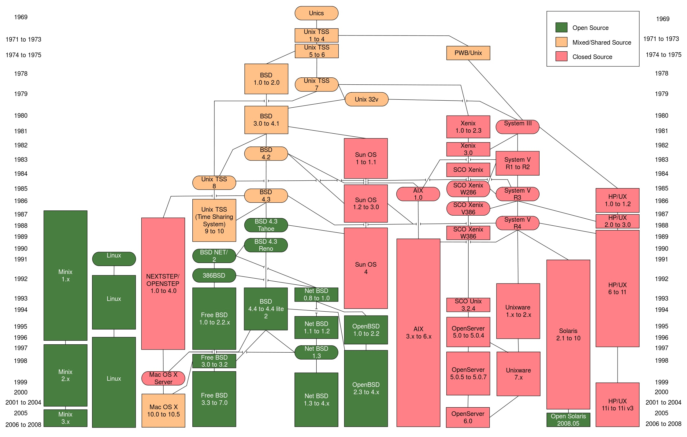
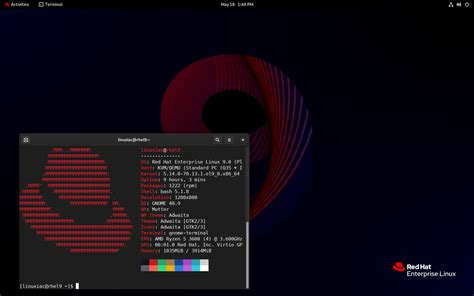

So what is all this? Linux, Unix, GNU, Kernel? You may already know or you may not. Either way, in this blog, I will try to explain the Linux kernel and its ecosystem in system software.

### How it all started?

In 1983, Richard Stallman launched the GNU project with the goal of creating a free UNIX-like operating system. The GNU project was a collaborative effort to develop a complete operating system that would be free software, meaning that users would have the freedom to run, study, modify, and distribute the software. However, the GNU project lacked a kernel, which is the core component of an operating system that manages system resources and provides essential services to applications. Stallman and the GNU project developers attempted to develop a kernel called Hurd, but progress was slow. So in 1991, Linus Torvalds, a Finnish computer science student, created the Linux kernel as a hobby project. Torvalds released the Linux kernel under the GNU General Public License (GPL), which allowed it to be combined with the GNU operating system to create a complete free operating system. The combination of the Linux kernel and the GNU operating system utilities formed the basis of what is now known as the Linux operating system.

### The Modern ecosystem

Today the modern ecosystem of Operating systems is divided into two categories.
   *Microsoft depenedt OS like Windows and all its versions.
   *Unix based (Everything else apart from Windows)
If you wish to learn more about OS and its desendents you can checkout [Operating Systems by Eylenburg](https://eylenburg.github.io/pics/Eylenburg_Operating_System_Timeline_Family_Tree.svg)

### What is UNIX?

UNIX is a family of multitasking, multiuser computer operating systems that derive from the original AT&T Unix, whose development started in the 1970s at the Bell Labs research center by Ken Thompson, Dennis Ritchie, and others. UNIX was one of the first operating systems to be written in a high-level programming language, namely C, which allowed it to be ported to a variety of computer platforms. This portability made UNIX a popular choice for universities and research institutions, leading to its widespread adoption. Over time, various versions of UNIX were developed, including BSD UNIX, SunOS, AIX, HP-UX, and others. UNIX-based operating systems are known for their stability, security, and scalability, making them popular choices for servers and high-performance computing environments.

 image source: [Softpedia](https://news.softpedia.com/news/40-Years-of-Unix-119827.shtml)

Though today UNIX is not being actively developed or used, still all modern OS apart from Windows are based on UNIX. Basically, UNIX is the father of all modern OS.

### What is Linux?

Linux stared as a clone of UNIX. It is an open-source operating system kernel. However, Linux is not a direct descendant of UNIX but rather a reimplementation that was inspired by UNIX. Linux is an OS kernel not an entire OS itself. When we talk about Linux based OS we refer to the Linux Distribution or distro. Normally the linux distro is bundled with the Linux kernel, GNU utilities, a shell, package manager, and other software to form a complete operating system. Linux is known for its stability, security, and flexibility, and it is widely used in servers, embedded systems, and mobile devices. The Linux kernel is released under the GNU General Public License (GPL), which allows anyone to view, modify, and distribute the source code. This open-source nature has led to a vibrant community of developers contributing to the kernel's development and improvement.

### What is Kernel?

The **Kernel** is the core component of any operating system that manages everything from system resources to hardware devices. It acts as an intermediary between the hardware and the software, providing essential services to applications and ensuring that they can interact with the underlying hardware in a secure and efficient manner. The kernel is responsible for tasks such as process management, memory management, device drivers, file system management, and system calls. It plays a crucial role in the overall performance and stability of the operating system. This is how Applications interact with the hardware and how Kernel manages each process.

 image source: [Kernel Architecture](https://cdn.linuxfordevices.com/)

*This how Kernel functions in a system.
When you boot up your computer, the kernel is the first piece of software that gets loaded into memory. It initializes the hardware devices, sets up the system environment, and starts the necessary system services. Once the kernel is up and running, it remains in memory and manages all system resources and processes until the computer is shut down. Basically it tells your system and applications how to work, what to do, how to do it, when to do it and under what conditions.*

### Memory Management in Linux Kernel

This is a complex topic but I will try to sum it up in fewer words best of my understanding. First of all, the kernel is not pageable (it means it cannot be swapped out to disk). The kernel is always in memory. The kernel uses a technique called **paging** to manage memory. Paging is a memory management scheme that allows the kernel to divide memory into fixed-size blocks called pages. Each page is mapped to a physical memory address, and the kernel maintains a page table that maps virtual memory addresses to physical memory addresses. When an application requests memory, the kernel allocates a page of memory and updates the page table to reflect the mapping. The kernel also uses a technique called **swapping** to manage memory. Swapping is a process in which the kernel moves pages of memory between physical memory and disk storage to free up memory for other applications. The kernel uses a swap partition on the disk to store pages that are not currently in use. When an application needs a page of memory that is not in physical memory, the kernel swaps out a page from physical memory to the swap partition and swaps in the requested page from the swap partition to physical memory. This allows the kernel to maximize the use of physical memory and ensure that applications have access to the memory they need.

### Note Worthy Features of Linux Kernel

* **Open Source**: The Linux kernel is released under the GNU General Public License (GPL), which allows anyone to view, modify, and distribute the source code. This open-source nature has led to a vibrant community of developers contributing to the kernel's development and improvement.
* **Modular Design**: The Linux kernel is designed to be modular, meaning that it can be extended and customized through the use of loadable kernel modules. These modules can be loaded and unloaded dynamically to add or remove functionality from the kernel without requiring a system reboot.
* **Advanced Memory Management**: The Linux kernel includes advanced memory management features, such as virtual memory, memory protection, and memory allocation algorithms. These features help optimize system performance and ensure that applications can run efficiently.
* **Device Drivers**: The Linux kernel includes a wide range of device drivers that allow it to support a variety of hardware devices, including processors, storage devices, network interfaces, and input/output devices. These device drivers are essential for enabling the kernel to communicate with and control hardware devices.
* **VFS**: The Virtual File System (VFS) is a layer within the Linux kernel that abstracts the file system interface, allowing different file systems to be used interchangeably. This modular design enables the kernel to support a wide range of file systems, including ext4, Btrfs, XFS, and others.

### Popular Linux Distributions

| Distro | Package Manager |  Desktop Environment | Snippet |
| --- | --- | --- | --- |
| Ubuntu | APT | GNOME |  |
| Fedora | DNF | GNOME |  |
| Debian | APT | GNOME |  |
| CentOS | YUM | GNOME |  |
| Arch Linux | Pacman | GNOME | |
| OpenSUSE | Zypper | KDE | |
| Manjaro | Pacman | KDE |  |
| Kali Linux | APT | GNOME | |
| RHEL | YUM | GNOME | |
| Mint | APT | Cinnamon |   |
| Backtrack | APT | GNOME |  |

**Core Components of a distribution**
*As we have discussed, a linux distro comes with the linux kernel, a shell, a filesystem, a bunch of GNU tools, and other system software. Let us discuss in brief what each of these components do, and how they help the operating system function.*

**Init System​** *Init system (short of for initialization), is the first process started during booting of the operating system. Init is a daemon process that continues running until the system is shut down. It is the direct or indirect ancestor of all other processes and automatically adopts all orphaned processes. Init is started by the kernel during the booting process. The process ID of init system is PID 1. The init system with the help of the kernel initialises all hardware on the computer. The init scripts are launched by the init process to guarantee basic functionality on system start and shutdown. This includes (un)mounting of file systems and launching of daemons (background services).*

**Filesystem​** *A file system or filesystem controls how data is stored and retrieved. Without a file system, information placed in a storage medium would be one large body of data with no way to tell where one piece of information stops and the next begins. By separating the data into pieces and giving each piece a name, the information is easily isolated and identified. Taking its name from the way paper-based information systems are named, each group of data is called a "file". The structure and logic rules used to manage the groups of information and their names is called a "file system".*

**The shell​** *A shell is a computer interface to an operating system. It exposes the operating systems' services (init system for example) to human users. The shell takes our commands, and gives them to the operating system to perform. It is called a shell because it is an outer protective layer around the operating system.*

**GNU tools​** *These are important tools that are present in some form since the UNIX days. The GNU toolchain is a broad collection of programming tools produced by the GNU Project. These tools form a toolchain (a suite of tools used in a serial manner) used for developing software applications and operating systems.*

**Package manager​** *A package manager or package-management system is a collection of software tools that automates the process of installing, upgrading, configuring, and removing computer programs for a computer in a consistent manner*

**Desktop Enviroment​** *A desktop environment bundles together a variety of components to provide common graphical user interface elements such as icons, toolbars, wallpapers, and desktop widgets. Additionally, most desktop environments include a set of integrated applications and utilities. Most importantly, desktop environments provide their own window manager, which can however usually be replaced with another compatible one.The user is free to configure their GUI environment in any number of ways. Desktop environments simply provide a complete and convenient means of accomplishing this task.*

### Afterthoughts

I hope this blog helped you understand the some concepts of the Linux kernel and its ecosystem in system software. The OS and Kernel are vast topics and I have tried to sum it up in a few words.Thank you for reading.
