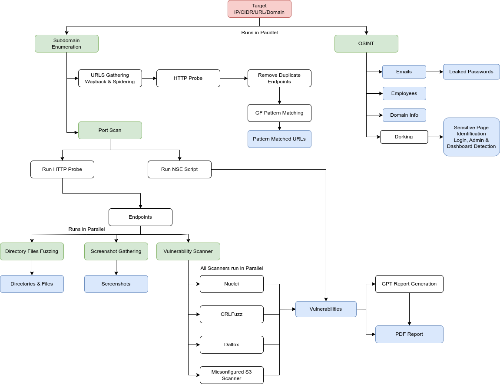

### WTF is recon?

Well for your puny brains recon is a process/processes or methods to gain intel on target. It's basically like making a list of things you are gonna buy to go camping. The very first step in any security assessment is recon. So it important shit. You can't hack for shit if you don't know anything about your target. Simple as that.

### Moving Forward

There are mainly two types of recon. Active and Passive both are what they sound like in active recon you deal with target well actively and in passive you do is passively. Not very clear is that? Well in active recon you are not bothered about target knowing that you trying to gather shit on them and while in passive we want to keep engagement as little as possible and gather as much information you can.

### Process

Recon is performed in two ways. Either you do it manually or setup some scripts or use open-source tools to automate it, either is fine given that you know what you are doing. The general way in both of these method is to initially read the engagement document this is generally scope defined by the program or private conversation between you and the client the goal is to get couple of things straight what are rules of engagement? which assets are under scope which are out of scope?, what is testing period? what type of testing is prohibited includes (DOS, DDOS, Phishing etc) so these are generalities which you must get straight before-hand to avoid any future conflicts.

Now that we have cleared the basics the next step involves thorough study of the target here you collect, read, study as much as you can about your target this gives you a clear idea of how the infrastructure is setup so that you can create a attack surface of the target.

### Manual Testing

Manual testing is most reliable in any case only problem is its time consuming and requires a lot of patience. In manual testing you are required to gather information about the target by visiting the target website, social media profiles, whois records, DNS records, subdomains, IP addresses, email addresses, phone numbers, etc. This is a very time consuming process but it is very rewarding as well. The common practice involves gathering info on target such as (this is very general and it is recommended that you come up with your unique way)

* **Open Source**: Use search engines, github, gitlab to do some dorking.
  
* **Public facing assets**: Check for public facing assets like websites, subdomains, IP addresses, etc.

* **In-scope assets**: Check for in-scope assets like web applications, mobile applications, APIs, etc.

* **Read previous reports**: Read previous reports to get an idea of what has been tested before in many cases if certain bug has been fixed before on one endpoint it is possible that it is still present on another endpoint.

* **Read JS files**: Read JS files in many cases developers leave sensitive information in JS files. (Use Fuzzing)

After all this you now have a good understanding of the target, attack surface with all the info you can start pentesting the target.

### Automated Testing

It is exactly what it sounds like. Use Free/Fermium/Paid tools to do the digging for you and if you are good at scripting you can setup your own automation scripts gives you a lot of flexibility and control over the process. There are infinite number of tools that you can find and my suggestion would be to use what fits best to your needs. I will discuss a simple automation process using an open-source tool [reNgine](https://github.com/yogeshojha/rengine) its not just a tool but a complete framework to automate recon process. **Note**: Its only for those who can pay for a vps or have extra hardware lying around.

### Workflow



### Requirements

* VPS or a machine with 8-16GB RAM and 2-4 CPU cores 100DGB storage. (My recommendation is is to signup for multiple free cloud services which offer free credits eg. Azure $200 credit, AWS $100 credit, GCP $300 credit, etc.) you should use Azure as it doesn't require any credit card.
  
* Select an OS image and get that VPS up and running. (I recommend latest Ubuntu)

* Follow this [installation guide](https://yogeshojha.github.io/rengine/) or use these commands

```bash
git clone https://github.com/yogeshojha/rengine && cd rengine
```

#### Edit the dotenv file, please make sure to change the password for postgresql POSTGRES_PASSWORD

```bash
nano .env
```

#### Run the installation script,  if ./install.sh does not have install permission, please change it, chmod +x install.sh

```bash
sudo ./install.sh
```

#### reNgine can now be accessed from [https://127.0.0.1](https://127.0.0.1) or if you’re on the VPS [https://your_vps_ip_address](https://your_vps_ip_address)

### General Usage

* **Note** You can refer the main [documentation](https://yogeshojha.github.io/rengine/) here for more details. (All credits to the author)

### Outro

Thanks for reading this blog post. I hope you learned something new.
